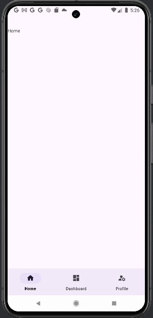
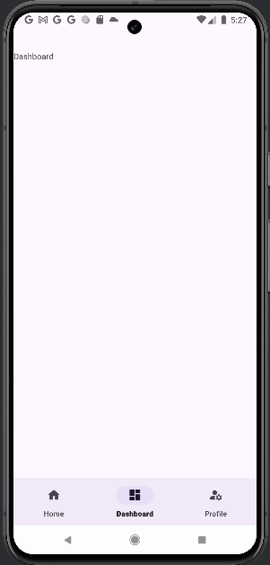
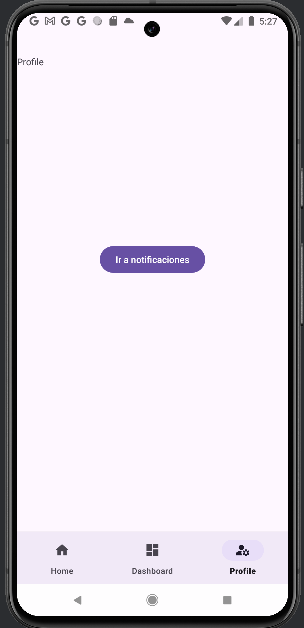
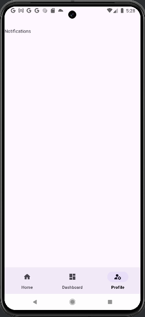

## 🙋🏻‍♂️ What is this project about?
Basic application that displays in an initial fragment a navigation bar with three options at the bottom of the layout. When you select any of the options, a new fragment is displayed in which you can put content in relation to the selected option.  
## 🖥️ Programming environment
Android Studio.  
## 🗒️ Programming language 
Java.  
## 📱 Screens  
   
